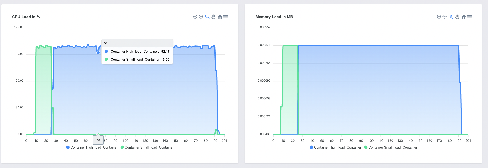

# ⚠️ Disclaimer ⚠️

This tool is currently in experimental status and only suitable for development purposes. 

Please do not run in a production environment. Especially not without proper isolation of the containers.

Currently no special setup is done to isolate the containers from the host OS and an escape may easily be possible.

Ensure that you run this only in an isolated VM / dedicated server.

# Introduction

This repository contains the command line tools to schedule and run the measurement report
as well as a web interface to view the measured metrics in some nice charts.

> Web Charts demo with docker stats provider instead of energy

# Measurement methodology

The software can orchestrate Docker containers according to a given specificaion in a usage-flow.json file.

These containers will be setup on the host system and the testing specification in the usage-flow will be
run by sending the commands to the containers accordingly.

During this process the performance metrics of the containers are read through the stream of 
`docker stats`.

The current limitation of this approach is:
- The resolution of 1s is pretty low
- Docker stats gives sometime out different value than top / /proc/stat depending on your OS configuration
- It does not directly translate into energy without an appropriate transfer model.

These problems are currently addressed by doing research on either using onboard hardware sensors or measuring 
the electrical signals directly on-chip or on the cables of the machine.

We hope to refine the approach soon and update the tool accordingly (Thanks for @mrchrisadams requesting this clarification)

The next part README will guide you through the installation on your server / cloud instance.

# Installation

## Method 1: Use our provided Dockerfiles

Very fast installation method mainly for development purposes and getting to know the tool.

Please see the documentation under [Dockerfiles method](https://github.com/green-coding-berlin/green-metrics-tool/tree/main/Docker)

## Method 2: Install directly on linux machine

Production ready installation method, which may require some Linux experience.

Please see the documentation under [Manual installation](https://github.com/green-coding-berlin/green-metrics-tool/blob/main/MANUAL_INSTALLATION.md)

# Usage

Once you have the tool either installed through the Dockerfiles or directly on your machine you can access the
web interface through: http://metrics.green-coding.local:8000

## Important note on usage

If have opted for the Dockerfiles Installation and want to use the manual mode or cron mode of the `runner.py`
you must make a copy of the `tools` directory of this repository as well as create a `config.yml` file.

These must be run outside of the Docker containers, because otherwise you would run into a "Docker inside Docker" case, which has caveats.\
So here please create a new directory, copy the `config.yml.example` and rename it to `config.yml` and populate it with the connection details
of the database from the Docker container which you have seen in [Dockerfiles method](https://github.com/green-coding-berlin/green-metrics-tool/tree/main/Docker).\

Then copy `tools` directory also into that folder.

## Cron mode

If you have installed a cronjob you can insert a new job at http://metrics.green-coding.local:8000/request.html

  

>  Cron mode job insertion for green metrics tool

It will be automatically picked up and you will get sent an email with the link to the results.

In order for the email to work correctly you must set the configuration in your used `config.yml`, either
on your Host OS or in your Docker containers depending on the installation mode you choose.

## Manual mode

If have opted for the Manual Installation and want to use the manual mode of the `runner.py`
just go  `tools` folder.

Now you can use the `runner.py` tool to trigger a run of the tool manually.
\
\
An example call would be like so: `runner.py manual --folder /path/to/my_demo_software --name My_Name`

The tool expects a `usage_scenario.json` inside of that folder. It will read it, orchestrate the containers
and give you the ID of the run.

If you have questions regarding how to create a `usage_scenario.json` please see: https://github.com/green-coding-berlin/green-metric-demo-software

To see a working live example with some metrics go to: https://metrics.green-coding.org/

