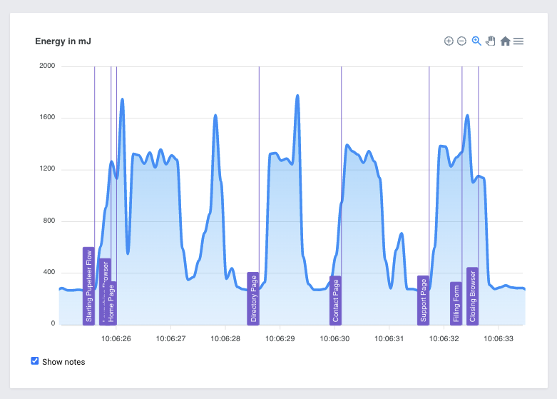

# ⚠️ Disclaimer ⚠️

This tool is currently in experimental status and only suitable for development purposes. 

Please do not run in a production environment. Especially not without proper isolation of the containers.

Currently no special setup is done to isolate the containers from the host OS and an escape may easily be possible.

Ensure that you run this only in an isolated VM / dedicated server.

# Introduction

The Green Metrics Tool can orchestrate Docker containers according to a given specificaion in a usage-flow.json file.

These containers will be setup on the host system and the testing specification in the usage-flow will be
run by sending the commands to the containers accordingly.

During this process the performance metrics of the containers are read through different metric providers like:
- cgroup CPU
- cgroup memory
- INTEL RAPL
- etc.

This repository contains the command line tools to schedule and run the measurement report
as well as a web interface to view the measured metrics in some nice charts.

# Frontend
To see the frontend in action and get an idea of what kind of metrics the tool can collect and display go to out [Green Metrics Frontend](https://metrics.green-coding.berlin)

# Documentation

To see the the documentation and how to install and use the tool please go to [Green Metrics Tool Documentation](https://docs.green-coding.berlin)

# Screenshots

> Web Flow Demo with CPU measurement provider
> 
- update test badges to link to workflow run page

> Web Flow Demo with energy measurement provider
> 
